# Agent Runtime Architecture

This document describes the architecture of the agent runtime system, including data flows, class responsibilities, and the type system.

## Overview

The agent runtime orchestrates AI agents (Claude via Agent SDK, Gemini via CLI) in isolated Modal sandboxes. It provides a backend runtime and React client library for building applications with AI agents.

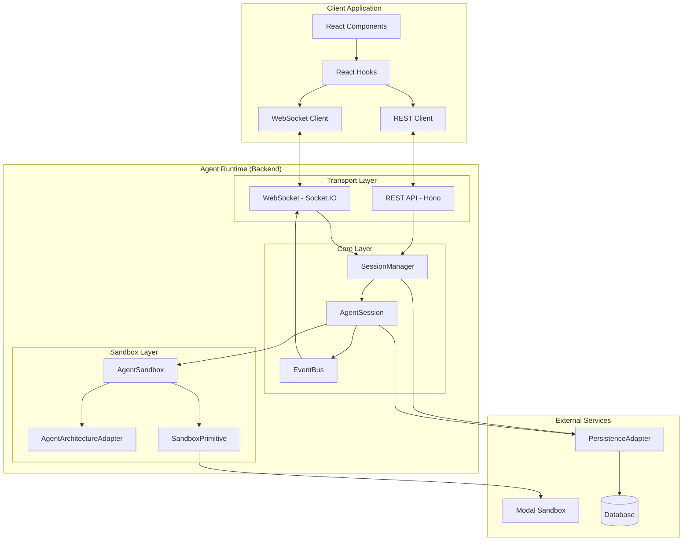

## Core Classes

### SessionManager

**Location:** `backend/src/core/session-manager.ts`

**Responsibility:** Container that orchestrates all agent sessions. Entry point for session operations.

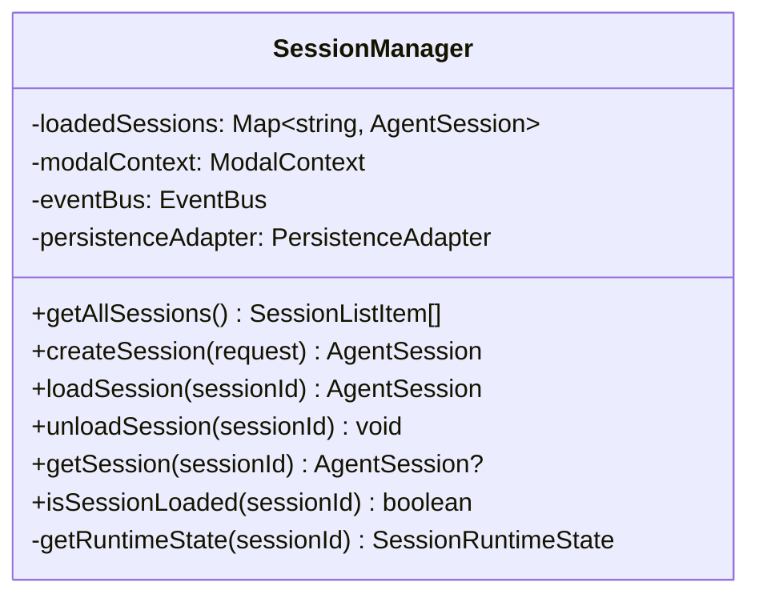

**Key Operations:**
- `getAllSessions()` - Fetches from persistence, enriches with runtime state
- `createSession()` - Creates new session, loads into memory (no sandbox yet)
- `loadSession()` - Loads existing session from persistence into memory (no sandbox yet)
- `unloadSession()` - Syncs to persistence, terminates sandbox if exists, removes from memory

### AgentSession

**Location:** `backend/src/core/agent-session.ts`

**Responsibility:** Manages individual session lifecycle, sandbox creation, and message execution.

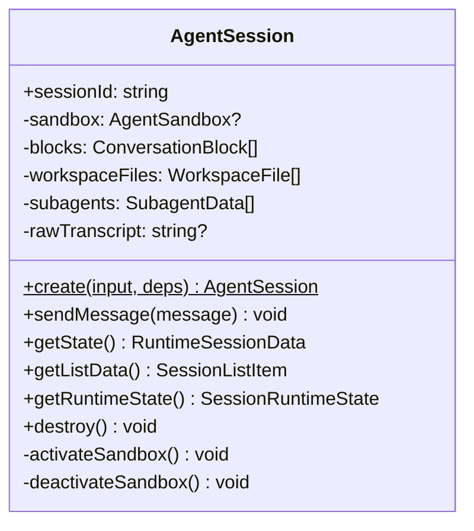

**Key Operations:**
- `create()` - Static factory, loads data from persistence, parses transcript (no sandbox)
- `sendMessage()` - Creates sandbox if needed, executes agent query
- `activateSandbox()` - Private method to create sandbox on demand
- `deactivateSandbox()` - Terminates sandbox, keeps session in memory
- `destroy()` - Full cleanup (sync + terminate sandbox + ready for removal from SessionManager)

### AgentSandbox

**Location:** `backend/src/core/agent-sandbox.ts`

**Responsibility:** Unified wrapper around Modal sandbox with agent-specific operations.

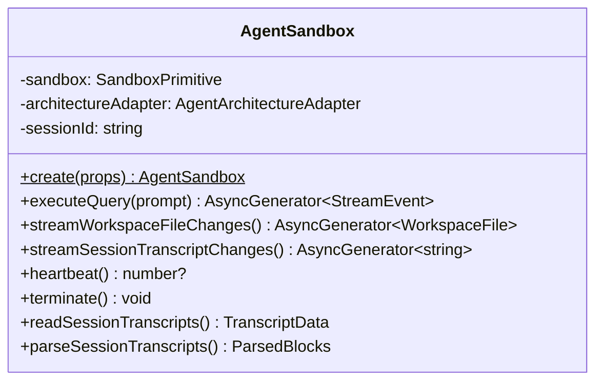

### EventBus

**Location:** `backend/src/core/event-bus.ts`

**Responsibility:** Type-safe pub/sub for domain events, decouples business logic from transport.

---

## Type System

### Persistence Layer Types

These types are used by the `PersistenceAdapter` and represent what's stored in the database.

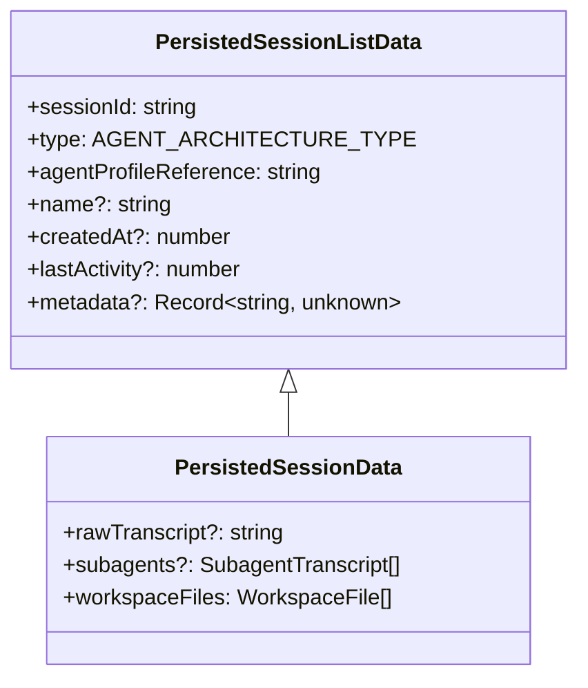

**Key Point:** No `status` field. The transcript is the source of truth for session state.

### Runtime Layer Types

These types are returned to clients and include runtime-derived state.

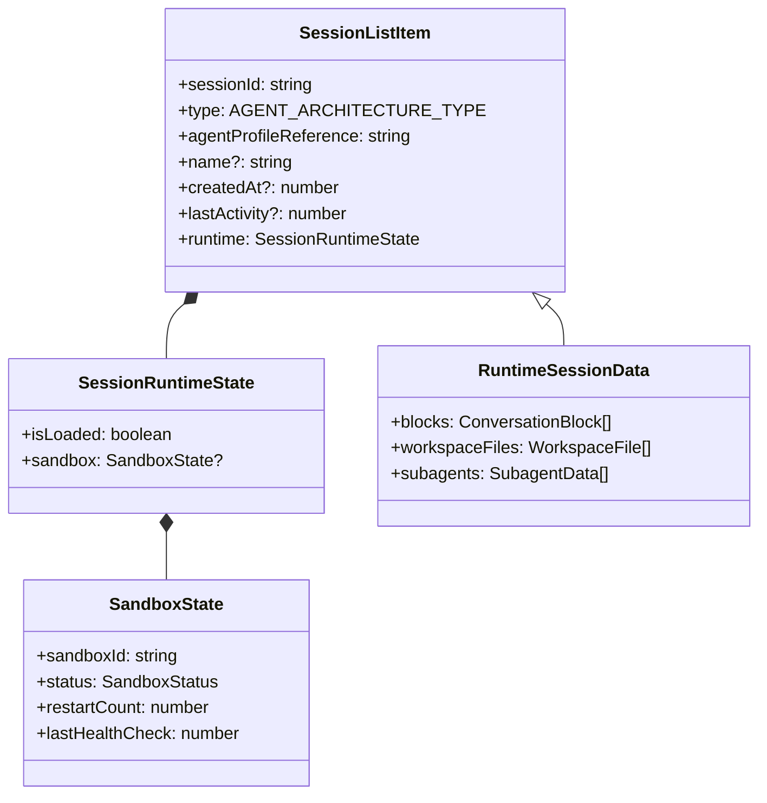

### Type Definitions

```typescript
// Sandbox status values
type SandboxStatus = 'starting' | 'ready' | 'unhealthy' | 'terminated';

// Runtime state (never persisted)
interface SessionRuntimeState {
  isLoaded: boolean;
  sandbox: {
    sandboxId: string;
    status: SandboxStatus;
    restartCount: number;
    lastHealthCheck: number;  // timestamp
  } | null;
}

// What clients see for session lists
interface SessionListItem extends PersistedSessionListData {
  runtime: SessionRuntimeState;
}

// Full session data for clients
interface RuntimeSessionData extends SessionListItem {
  blocks: ConversationBlock[];
  workspaceFiles: WorkspaceFile[];
  subagents: { id: string; blocks: ConversationBlock[] }[];
}
```

---

## Data Flows

### Session Creation Flow

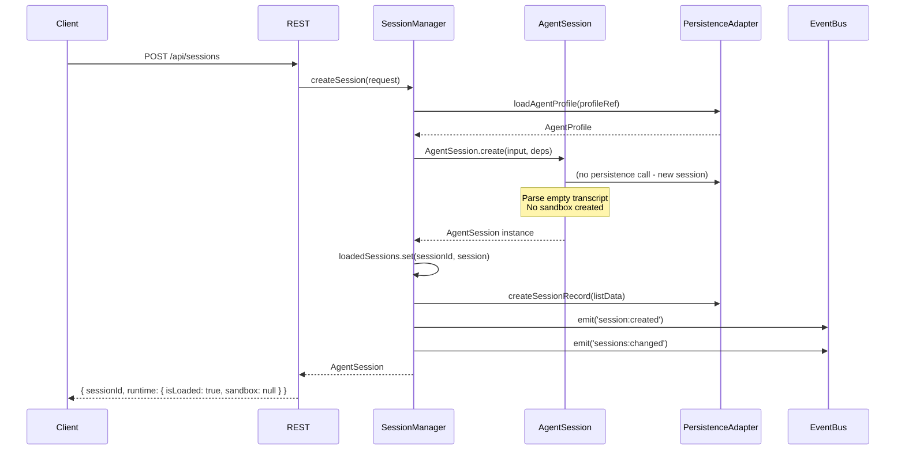

### Session Load Flow

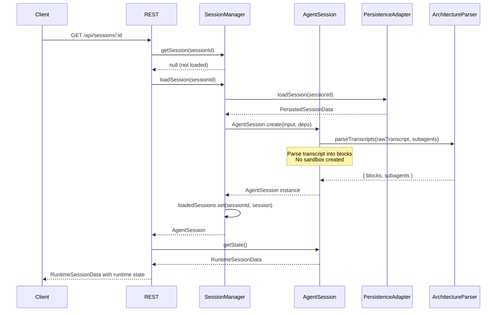

### Send Message Flow (Lazy Sandbox Creation)

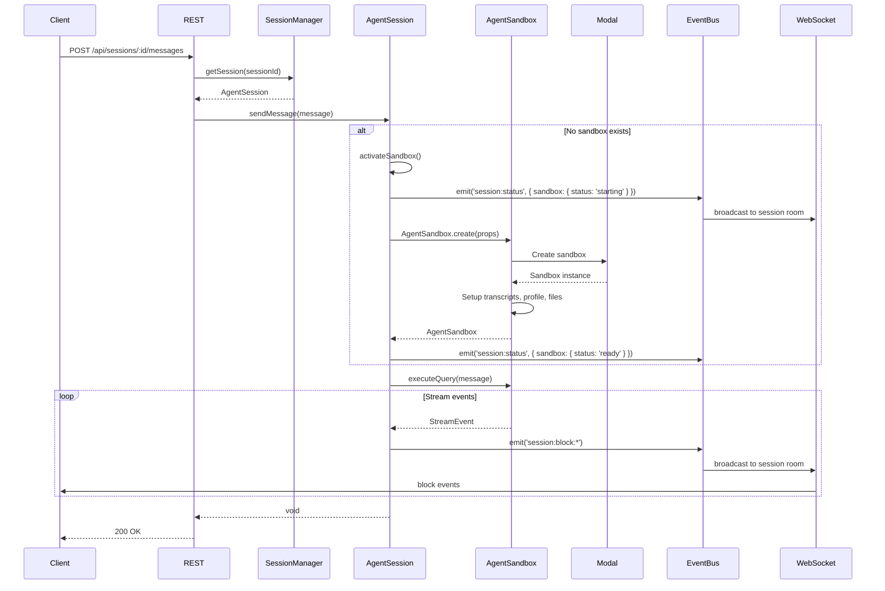

### Session Unload Flow (Modal Idle Timeout)

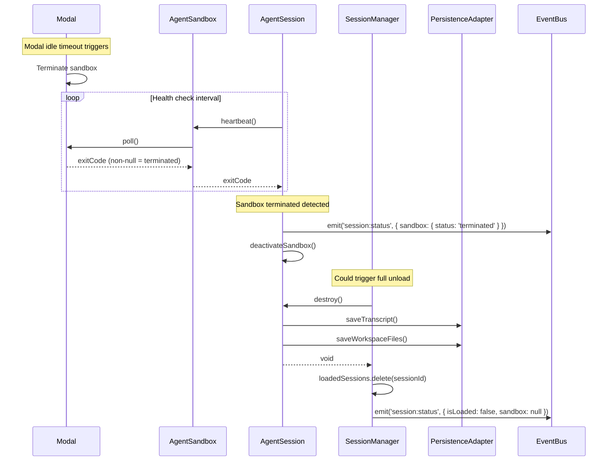

### List Sessions Flow (Enrichment)

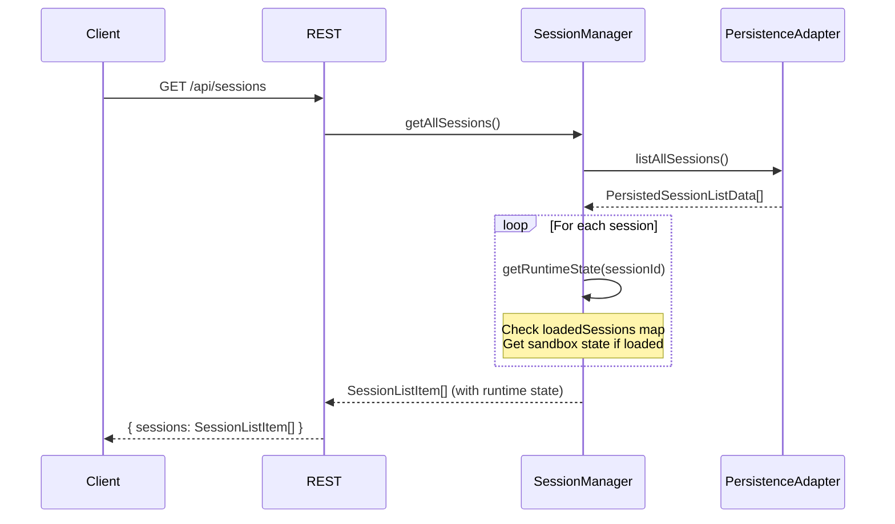

---

## Events

### Domain Events (EventBus)

```typescript
// Unified session status event
'session:status': {
  sessionId: string;
  runtime: SessionRuntimeState;
}

// Block streaming events
'session:block:start': { sessionId, conversationId, block }
'session:block:delta': { sessionId, conversationId, blockId, delta }
'session:block:update': { sessionId, conversationId, blockId, updates }
'session:block:complete': { sessionId, conversationId, blockId, block }

// Workspace events
'session:file:modified': { sessionId, file }

// Session list changed (triggers refetch)
'sessions:changed': void
```

### WebSocket Events (Client-facing)

Same as domain events - the event bridge forwards them to connected clients in the appropriate session rooms.

---

## State Diagram

### Session Lifecycle States

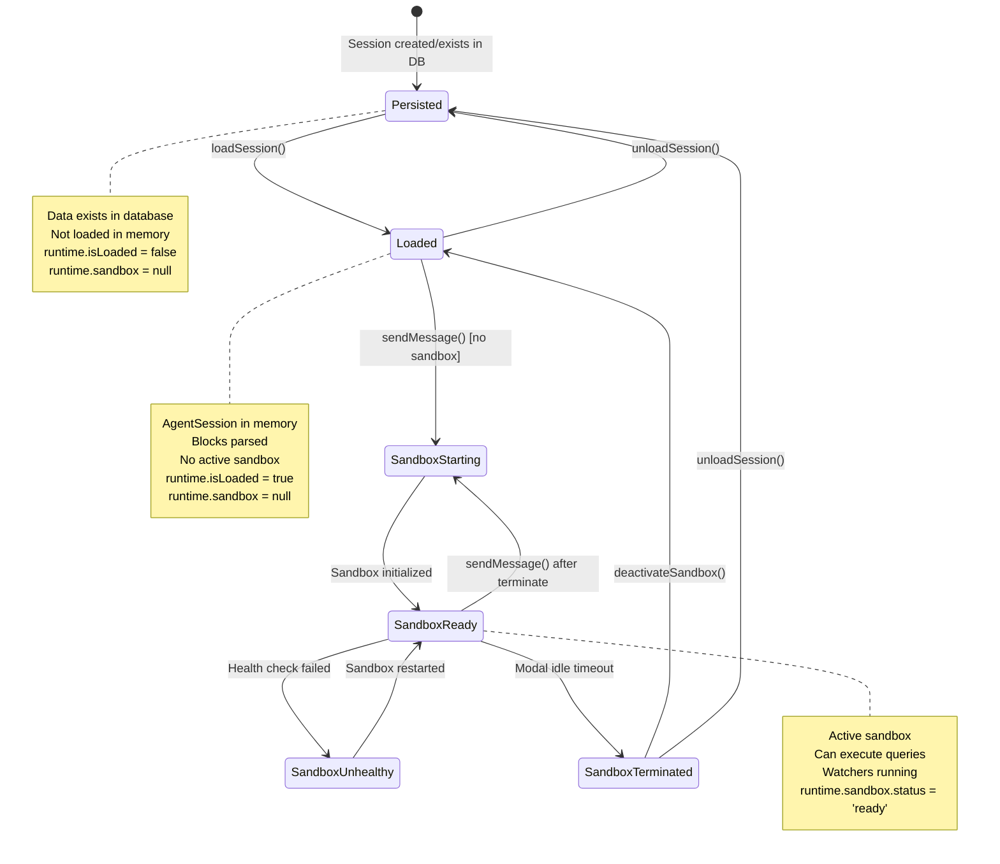

---

## Architecture Adapters

The `AgentArchitectureAdapter` interface abstracts the differences between agent architectures (Claude SDK, Gemini CLI).

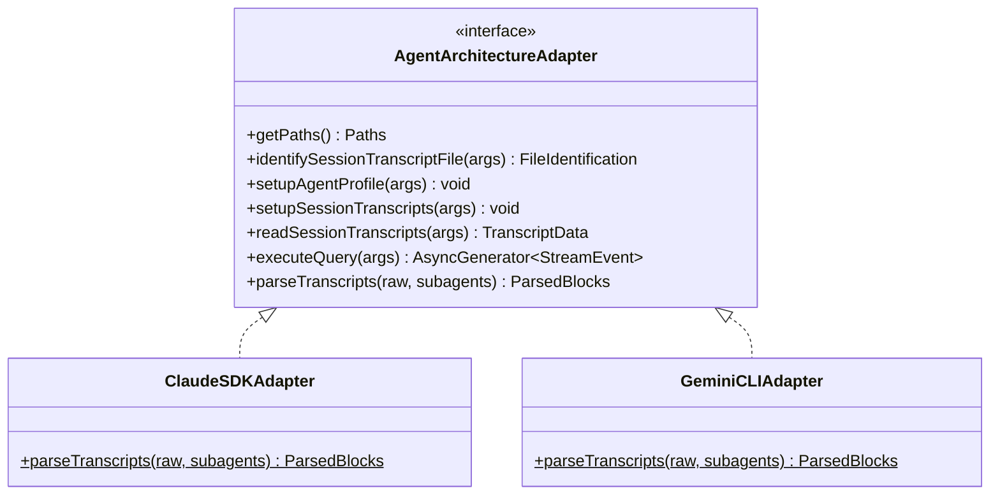

**Static Parsing:** Both adapters have a static `parseTranscripts()` method accessible via `getArchitectureParser(type)` factory function. This allows parsing transcripts without a sandbox.

---

## Persistence Adapter

The `PersistenceAdapter` interface allows applications to integrate with their storage layer.

```typescript
interface PersistenceAdapter {
  // Session operations (no status field)
  listAllSessions(): Promise<PersistedSessionListData[]>;
  loadSession(sessionId: string): Promise<PersistedSessionData | null>;
  createSessionRecord(session: PersistedSessionListData): Promise<void>;
  updateSessionRecord(sessionId: string, updates: Partial<PersistedSessionListData>): Promise<void>;

  // Storage operations
  saveTranscript(sessionId: string, rawTranscript: string, subagentId?: string): Promise<void>;
  saveWorkspaceFile(sessionId: string, file: WorkspaceFile): Promise<void>;
  deleteSessionFile(sessionId: string, path: string): Promise<void>;

  // Agent profile operations
  listAgentProfiles(): Promise<AgentProfileListData[]>;
  loadAgentProfile(agentProfileId: string): Promise<AgentProfile | null>;
}
```

---

## Key Design Decisions

### 1. No Persisted Status Field

**Rationale:** The transcript is the source of truth. Status like "active", "building-sandbox" are transient runtime states that don't make sense to persist.

**Implementation:** Runtime state is derived from:
- Is the session in `loadedSessions` map? → `isLoaded`
- Does the AgentSession have a sandbox? → `sandbox.exists`
- What's the sandbox health? → `sandbox.status`

### 2. Lazy Sandbox Creation

**Rationale:** Modal sandboxes are expensive. We shouldn't create one just to view session history.

**Implementation:**
- `loadSession()` only parses transcript and loads into memory
- `sendMessage()` creates sandbox on-demand via `activateSandbox()`
- Transcript parsing uses static `getArchitectureParser()` - no sandbox needed

### 3. Modal Idle Timeout as Unload Signal

**Rationale:** Long-running async tasks shouldn't be interrupted. Modal knows when a sandbox is truly idle.

**Implementation:**
- Health check detects sandbox termination (exitCode from `poll()`)
- Emits `session:status` with `sandbox.status = 'terminated'`
- Can trigger session unload or just sandbox deactivation

### 4. Type Separation (Persistence vs Runtime)

**Rationale:** Clear boundary between what's stored vs what's computed.

**Implementation:**
- `PersistedSessionListData` / `PersistedSessionData` - no runtime fields
- `SessionListItem` / `RuntimeSessionData` - extends persisted with `runtime: SessionRuntimeState`
- SessionManager enriches persistence data before returning to clients
